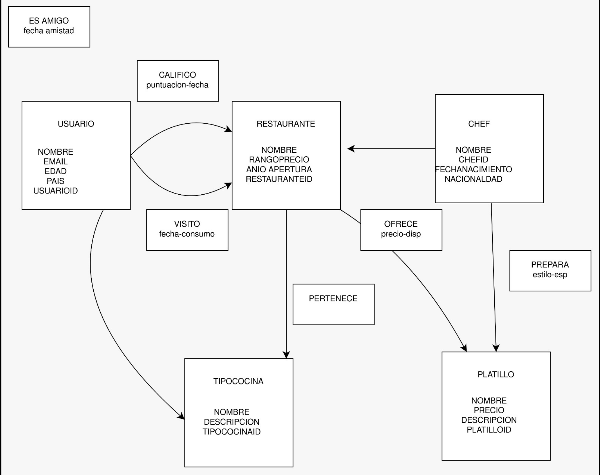

# Documentación Técnica

## Sistema de Recomendación de Restaurantes con Neo4j  
### Proyecto 2 — Grupo 14 — BD2 VACJUN26

---

## 1. Información general

Este proyecto implementa un sistema de recomendación de restaurantes utilizando Neo4j como motor de base de datos de grafos. El sistema modela las relaciones entre usuarios, restaurantes, chefs, platillos y tipos de cocina para generar recomendaciones personalizadas basadas en conexiones sociales, historial de calificaciones y chefs compartidos.

---


## 2. Tecnologías utilizadas

| Tecnología | Versión | Uso |
|---|---|---|
| Neo4j | 5.x | Motor de base de datos de grafos |
| Cypher | — | Lenguaje de consultas |
| Python | 3.8+ | Generación masiva de datos CSV |
| Faker | latest | Generación de datos sintéticos realistas |

---

## 3. Modelo de grafos conceptual

### 3.1 Nodos (etiquetas)

| Etiqueta | Propiedades | Descripción |
|---|---|---|
| `Usuario` | usuarioId, nombre, email, edad, pais | Personas que usan la plataforma |
| `Restaurante` | restauranteId, nombre, anioApertura, rangoPrecio, descripcion | Establecimientos gastronómicos |
| `TipoCocina` | tipoCocinaId, nombre, descripcion | Categorías gastronómicas |
| `Chef` | chefId, nombre, fechaNacimiento, nacionalidad | Líderes culinarios |
| `Platillo` | platilloId, nombre, precio, descripcion | Preparaciones ofrecidas |

### 3.2 Relaciones (aristas)

| Relación | Origen → Destino | Propiedades | Descripción |
|---|---|---|---|
| `CALIFICÓ` | Usuario → Restaurante | puntuacion [1-5], fecha, comentario | El usuario califica el restaurante |
| `VISITÓ` | Usuario → Restaurante | fechaVisita, consumo, conReserva | El usuario visita el restaurante |
| `ES_AMIGO_DE` | Usuario ↔ Usuario | fechaAmistad | Relación de amistad entre usuarios |
| `PERTENECE_A` | Restaurante → TipoCocina | — | El restaurante pertenece a una categoría |
| `OFRECE` | Restaurante → Platillo | precio, disponible | El restaurante ofrece un platillo |
| `PREPARA` | Chef → Platillo | estilo, especialidad | El chef prepara un platillo |
| `TRABAJA_EN` | Chef → Restaurante | fechaInicio, puesto | El chef trabaja en el restaurante |
| `LE_GUSTA` | Usuario → TipoCocina | nivelInteres [1-5] | El usuario prefiere un tipo de cocina |

### 3.3 Diagrama del modelo

```
(Usuario) --[CALIFICÓ {puntuacion, fecha, comentario}]--> (Restaurante)
(Usuario) --[VISITÓ {fechaVisita, consumo, conReserva}]--> (Restaurante)
(Usuario) --[ES_AMIGO_DE {fechaAmistad}]-- (Usuario)
(Usuario) --[LE_GUSTA {nivelInteres}]--> (TipoCocina)

(Restaurante) --[PERTENECE_A]--> (TipoCocina)
(Restaurante) --[OFRECE {precio, disponible}]--> (Platillo)

(Chef) --[TRABAJA_EN {fechaInicio, puesto}]--> (Restaurante)
(Chef) --[PREPARA {estilo, especialidad}]--> (Platillo)
```

---

## 4. Reglas de negocio implementadas

1. Un usuario puede calificar y visitar múltiples restaurantes.
2. Un restaurante puede pertenecer a varios tipos de cocina y ofrecer múltiples platillos.
3. Un chef puede trabajar en varios restaurantes y preparar múltiples platillos.
4. Las calificaciones están en el rango de 1 a 5 estrellas.
5. Un restaurante no puede ofrecer el mismo platillo más de una vez (constraint MERGE).
6. El sistema recomienda restaurantes basándose en chefs compartidos con restaurantes bien valorados y no visitados.

---

## 5. Constraints e índices

### Constraints de unicidad

```cypher
CREATE CONSTRAINT constraint_usuario_id IF NOT EXISTS
FOR (u:Usuario) REQUIRE u.usuarioId IS UNIQUE;

CREATE CONSTRAINT constraint_restaurante_id IF NOT EXISTS
FOR (r:Restaurante) REQUIRE r.restauranteId IS UNIQUE;

CREATE CONSTRAINT constraint_tipo_cocina_id IF NOT EXISTS
FOR (t:TipoCocina) REQUIRE t.tipoCocinaId IS UNIQUE;

CREATE CONSTRAINT constraint_chef_id IF NOT EXISTS
FOR (c:Chef) REQUIRE c.chefId IS UNIQUE;

CREATE CONSTRAINT constraint_platillo_id IF NOT EXISTS
FOR (p:Platillo) REQUIRE p.platilloId IS UNIQUE;
```

### Índices de búsqueda

```cypher
CREATE INDEX index_usuario_nombre  IF NOT EXISTS FOR (u:Usuario)     ON (u.nombre);
CREATE INDEX index_restaurante_nombre IF NOT EXISTS FOR (r:Restaurante) ON (r.nombre);
CREATE INDEX index_chef_nombre     IF NOT EXISTS FOR (c:Chef)        ON (c.nombre);
```

---

## 6. Carga masiva de datos

La carga se realiza mediante el comando `LOAD CSV` de Cypher con transacciones por lotes:

```cypher
:auto LOAD CSV WITH HEADERS FROM 'file:///usuarios.csv' AS row
CALL {
  WITH row
  MERGE (u:Usuario {usuarioId: row.usuarioId})
  SET u.nombre = row.nombre, ...
} IN TRANSACTIONS OF 500 ROWS;
```

El uso de `MERGE` garantiza que no se creen nodos duplicados. El uso de `IN TRANSACTIONS OF 500 ROWS` optimiza el rendimiento para grandes volúmenes.

### Datos cargados

| Entidad | Cantidad mínima | Cantidad generada |
|---|---|---|
| TipoCocina | 15 | 15 |
| Usuario | 500 | 500 |
| Restaurante | 200 | 200 |
| Chef | 100 | 100 |
| Platillo | 50 | 50 |
| CALIFICÓ | — | ~2,253 |
| VISITÓ | — | ~3,204 |
| ES_AMIGO_DE | — | ~2,713 |
| PERTENECE_A | — | ~408 |
| OFRECE | — | ~1,777 |
| PREPARA | — | ~495 |
| TRABAJA_EN | — | ~289 |
| LE_GUSTA | — | ~1,453 |

---

## 7. Consultas implementadas

### Consulta 1: Diversidad de tipos de cocina por restaurante

Cuenta cuántos tipos de cocina distintos representa cada restaurante.

```cypher
MATCH (r:Restaurante)-[:PERTENECE_A]->(t:TipoCocina)
RETURN r.nombre, count(t) AS cantidadTipos, collect(t.nombre) AS tiposCocina
ORDER BY cantidadTipos DESC LIMIT 20;
```

### Consulta 2: Tasa de reservas por restaurante

Calcula el porcentaje de visitas realizadas con reserva previa.

```cypher
MATCH (u:Usuario)-[v:VISITÓ]->(r:Restaurante)
WITH r, count(v) AS total,
     sum(CASE WHEN v.conReserva THEN 1 ELSE 0 END) AS conReserva
RETURN r.nombre, round(100.0 * conReserva / total, 2) AS tasaReservaPct
ORDER BY tasaReservaPct DESC LIMIT 20;
```

### Consulta 3: Usuarios con mayor gasto promedio por visita

Identifica usuarios de mayor poder adquisitivo.

```cypher
MATCH (u:Usuario)-[v:VISITÓ]->(r:Restaurante)
WITH u, count(v) AS visitas, avg(v.consumo) AS gastoPromedio
WHERE visitas >= 3
RETURN u.nombre, round(gastoPromedio, 2) AS gastoPromedio
ORDER BY gastoPromedio DESC LIMIT 20;
```

### Consulta 4: Usuarios con mayor frecuencia en período

Detecta los usuarios más activos dentro de un rango de fechas.

```cypher
WITH date('2023-01-01') AS fi, date('2024-06-01') AS ff
MATCH (u:Usuario)-[v:VISITÓ]->(r:Restaurante)
WHERE v.fechaVisita >= fi AND v.fechaVisita <= ff
RETURN u.nombre, count(v) AS visitasEnPeriodo
ORDER BY visitasEnPeriodo DESC LIMIT 20;
```

### Consulta 5: Restaurantes sin visitas recientes

Detecta restaurantes sin actividad en los últimos 180 días.

```cypher
WITH date() - duration('P180D') AS corte
MATCH (r:Restaurante)
OPTIONAL MATCH (u)-[v:VISITÓ]->(r)
WITH r, max(v.fechaVisita) AS ultima, corte
WHERE ultima IS NULL OR ultima < corte
RETURN r.nombre, ultima ORDER BY ultima ASC LIMIT 20;
```

### Consulta 6: Chefs con mayor movilidad laboral

Determina qué chefs han trabajado en más restaurantes.

```cypher
MATCH (c:Chef)-[:TRABAJA_EN]->(r:Restaurante)
WITH c, count(r) AS cantidadRestaurantes, collect(r.nombre) AS restaurantes
RETURN c.nombre, cantidadRestaurantes, restaurantes
ORDER BY cantidadRestaurantes DESC LIMIT 15;
```

### Consulta 7: Platillos con mayor variación de precio

Detecta platillos cuyo precio varía más entre restaurantes.

```cypher
MATCH (r:Restaurante)-[o:OFRECE]->(p:Platillo)
WITH p, min(o.precio) AS pMin, max(o.precio) AS pMax, count(r) AS numRest
WHERE numRest >= 2
RETURN p.nombre, round(pMax - pMin, 2) AS variacionPrecio
ORDER BY variacionPrecio DESC LIMIT 15;
```

### Consulta 8: Crecimiento de visitas por tipo de cocina

Compara visitas entre dos años para detectar tendencias.

```cypher
MATCH (u:Usuario)-[v:VISITÓ]->(r:Restaurante)-[:PERTENECE_A]->(t:TipoCocina)
WITH t,
     sum(CASE WHEN v.fechaVisita.year = 2022 THEN 1 ELSE 0 END) AS a2022,
     sum(CASE WHEN v.fechaVisita.year = 2023 THEN 1 ELSE 0 END) AS a2023
RETURN t.nombre, a2022, a2023,
       round(100.0 * (a2023 - a2022) / a2022, 2) AS crecimientoPct
ORDER BY crecimientoPct DESC;
```

### Consulta 9: Recomendación basada en chefs compartidos

Recomienda restaurantes donde trabajen chefs de restaurantes que el usuario ya calificó bien y que aún no visitó.

```cypher
WITH 'U0001' AS uid
MATCH (u:Usuario {usuarioId: uid})-[cal:CALIFICÓ]->(rBien:Restaurante)
WHERE cal.puntuacion >= 4
MATCH (chef:Chef)-[:TRABAJA_EN]->(rBien)
MATCH (chef)-[:TRABAJA_EN]->(rRec:Restaurante)
WHERE rRec <> rBien AND NOT (u)-[:VISITÓ]->(rRec)
RETURN DISTINCT rRec.nombre AS recomendado, chef.nombre AS chefCompartido
ORDER BY cal.puntuacion DESC LIMIT 10;
```

---

## 8. Análisis de redes

### Análisis 1: Rutas más cortas entre usuarios (grados de separación)

Utiliza el algoritmo `shortestPath` nativo de Neo4j para encontrar el camino mínimo entre dos usuarios a través de la red de amistades.

```cypher
MATCH (u1:Usuario {usuarioId: 'U0001'}),
      (u2:Usuario {usuarioId: 'U0050'})
MATCH path = shortestPath((u1)-[:ES_AMIGO_DE*1..10]-(u2))
RETURN length(path) AS gradosSeparacion,
       [n IN nodes(path) | n.nombre] AS ruta;
```

**Interpretación:** Un resultado de `gradosSeparacion: 2` significa que los dos usuarios tienen un amigo en común. Esto permite medir la cohesión de la red social.

### Análisis 2: Restaurantes altamente conectados

Calcula un puntaje de conectividad compuesto para identificar los restaurantes más relevantes en el grafo.

```cypher
MATCH (r:Restaurante)
OPTIONAL MATCH (c:Chef)-[:TRABAJA_EN]->(r)
OPTIONAL MATCH (r)-[:OFRECE]->(p:Platillo)
OPTIONAL MATCH (u:Usuario)-[:VISITÓ]->(r)
RETURN r.nombre,
       count(DISTINCT c) AS chefs,
       count(DISTINCT p) AS platillos,
       count(u)          AS visitas,
       (count(DISTINCT c)*3 + count(DISTINCT p)*2 + count(u)) AS puntaje
ORDER BY puntaje DESC LIMIT 15;
```

**Interpretación:** Los restaurantes con mayor puntaje son nodos "hub" del grafo: atraen más talento culinario, ofrecen más variedad y reciben más visitas.

---

## 9. Ventajas de Neo4j para este problema

1. **Traversal eficiente de relaciones:** Las consultas que atraviesan múltiples niveles de relaciones (usuarios → amigos → restaurantes → chefs) son nativas en Neo4j y mucho más eficientes que JOINs anidados en SQL.

2. **Modelado natural:** Las entidades del dominio (usuarios, chefs, restaurantes) y sus conexiones se representan de forma intuitiva como nodos y aristas, sin tablas intermedias.

3. **Algoritmos de grafos nativos:** `shortestPath`, centralidad y detección de comunidades son funciones incorporadas, no requieren implementación manual.

4. **Recomendaciones basadas en grafos:** El patrón "usuarios que visitaron X también visitaron Y" es una consulta Cypher simple, mientras que en SQL requeriría subconsultas complejas.

5. **Flexibilidad del esquema:** Agregar nuevos tipos de relaciones o propiedades no requiere migraciones de esquema, lo que facilita la evolución del sistema.

---

## 10. Estructura del repositorio

```text
Segundo Proyecto/
├── data/
│   └── csv/                   # Archivos CSV generados
│       ├── tipos_cocina.csv
│       ├── usuarios.csv
│       ├── restaurantes.csv
│       ├── chefs.csv
│       ├── platillos.csv
│       ├── calificaciones.csv
│       ├── visitas.csv
│       ├── amistades.csv
│       ├── pertenece_a.csv
│       ├── ofrece.csv
│       ├── prepara.csv
│       ├── trabaja_en.csv
│       └── le_gusta.csv
├── cypher/
│   ├── ddl/
│   │   └── 01_schema.cypher   # Constraints e índices
│   ├── load/
│   │   ├── 02_load_nodos.cypher
│   │   └── 03_load_relaciones.cypher
│   ├── queries/
│   │   └── 04_consultas.cypher  # 9 consultas de negocio
│   └── analysis/
│       └── 05_analisis_redes.cypher
├── python/
│   └── generate_data.py       # Generador de datos CSV
├── docs/
│   ├── tecnica/
│   │   └── documentacion_tecnica.md
│   └── usuario/
│       └── manual_usuario.md
└── README.md
```
