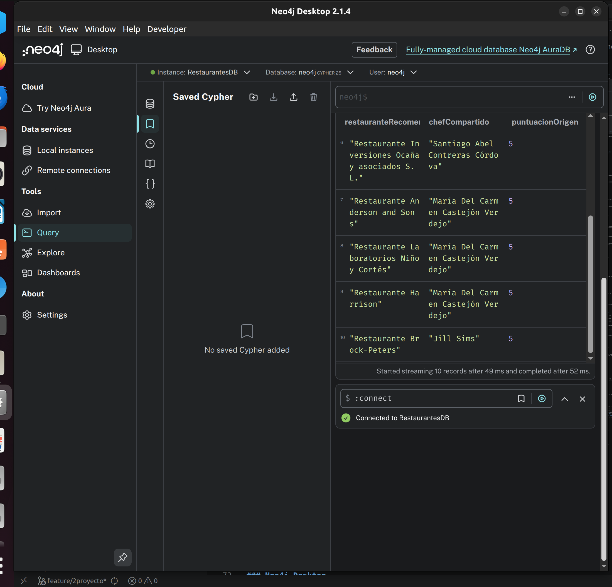

# Manual de Usuario

## Sistema de Recomendación de Restaurantes con Neo4j  
### Proyecto 2 — Grupo 14 — BD2 VACJUN26

---

## 1. Requisitos previos

- Neo4j Desktop 5.x o Neo4j Community Edition 5.x instalado
- Python 3.8 o superior (para generación de datos)
- Librería `faker` instalada (`pip install faker`)

---

## 2. Instalación de Neo4j

### Opción A: Neo4j Desktop (recomendado)

1. Descarga Neo4j Desktop desde [https://neo4j.com/download/](https://neo4j.com/download/)
2. Instala y abre la aplicación
3. Haz clic en **New** → **Create project**
4. Dentro del proyecto, haz clic en **Add** → **Local DBMS**
5. Asigna un nombre (ej. `RestaurantesDB`) y una contraseña
6. Haz clic en **Create** y luego en **Start**


### Opción B: Neo4j Community Edition

```bash
# Linux/Mac
wget https://neo4j.com/artifact.php?name=neo4j-community-5.x.x-unix.tar.gz




tar -xzf neo4j-community-5.x.x-unix.tar.gz
cd neo4j-community-5.x.x
./bin/neo4j start
```

Accede a Neo4j Browser en: `http://localhost:7474`

---

## 3. Generación de datos CSV

Desde la raíz del proyecto, ejecutar:

```bash
cd "Segundo Proyecto"
pip install faker
python python/generate_data.py
```

Los archivos CSV se generarán en `data/csv/`. Debes ver en consola:

```
[OK] tipos_cocina.csv: 15 filas
[OK] usuarios.csv: 500 filas
[OK] restaurantes.csv: 200 filas
[OK] chefs.csv: 100 filas
[OK] platillos.csv: 50 filas
...
```

---

## 4. Copiar archivos CSV al directorio import de Neo4j

Neo4j solo puede leer archivos CSV desde su directorio `import/`.

### Neo4j Desktop

1. En Neo4j Desktop, haz clic en los tres puntos (**...**) del DBMS
2. Selecciona **Open Folder** → **Import**
3. Copia todos los archivos de `data/csv/` a esa carpeta

### Neo4j Community Edition

```bash
cp data/csv/*.csv /ruta/a/neo4j/import/
```

---

## 5. Crear el esquema (constraints e índices)

En Neo4j Browser, abre el archivo `cypher/ddl/01_schema.cypher` y ejecuta cada bloque, o copia y pega el contenido completo.

**Verificar constraints creados:**

```cypher
SHOW CONSTRAINTS;
```

**Verificar índices creados:**

```cypher
SHOW INDEXES;
```

---

## 6. Carga masiva de datos

### Paso 1: Cargar nodos

Abre `cypher/load/02_load_nodos.cypher` en Neo4j Browser y ejecuta todos los bloques en orden.

**Verificación de nodos cargados:**

```cypher
MATCH (n) RETURN labels(n)[0] AS Etiqueta, count(n) AS Total ORDER BY Total DESC;
```

Resultado esperado:

| Etiqueta | Total |
|---|---|
| Usuario | 500 |
| Restaurante | 200 |
| Chef | 100 |
| Platillo | 50 |
| TipoCocina | 15 |

### Paso 2: Cargar relaciones

Abre `cypher/load/03_load_relaciones.cypher` y ejecuta todos los bloques en orden.

**Verificación de relaciones cargadas:**

```cypher
MATCH ()-[r]->() RETURN type(r) AS Relacion, count(r) AS Total ORDER BY Total DESC;
```

---

## 7. Ejecutar las consultas de negocio

Abre `cypher/queries/04_consultas.cypher` en Neo4j Browser.

### Consulta 1 – Diversidad de tipos de cocina

```cypher
MATCH (r:Restaurante)-[:PERTENECE_A]->(t:TipoCocina)
RETURN r.nombre, count(t) AS cantidadTipos
ORDER BY cantidadTipos DESC LIMIT 20;
```

**Interpretación:** Muestra cuántas categorías gastronómicas cubre cada restaurante. Un restaurante con 3 tipos tiene mayor diversidad de oferta.

### Consulta 2 – Tasa de reservas

```cypher
MATCH (u:Usuario)-[v:VISITÓ]->(r:Restaurante)
WITH r, count(v) AS total,
     sum(CASE WHEN v.conReserva THEN 1 ELSE 0 END) AS conReserva
RETURN r.nombre, round(100.0 * conReserva / total, 2) AS tasaReservaPct
ORDER BY tasaReservaPct DESC LIMIT 20;
```

**Interpretación:** Porcentajes altos indican restaurantes donde los clientes planifican con anticipación, señal de alta demanda.

### Consulta 3 – Gasto promedio por usuario

```cypher
MATCH (u:Usuario)-[v:VISITÓ]->(r:Restaurante)
WITH u, count(v) AS visitas, avg(v.consumo) AS gasto
WHERE visitas >= 3
RETURN u.nombre, round(gasto, 2) AS gastoPromedio
ORDER BY gastoPromedio DESC LIMIT 20;
```

**Interpretación:** Identifica usuarios de alto valor para estrategias de fidelización.

### Consulta 4 – Frecuencia de visitas en un período

Modifica las fechas según el período que desees analizar:

```cypher
WITH date('2023-01-01') AS fi, date('2024-06-01') AS ff
MATCH (u:Usuario)-[v:VISITÓ]->(r:Restaurante)
WHERE v.fechaVisita >= fi AND v.fechaVisita <= ff
RETURN u.nombre, count(v) AS visitasEnPeriodo
ORDER BY visitasEnPeriodo DESC LIMIT 20;
```

### Consulta 5 – Restaurantes sin visitas recientes

Cambia `P180D` por el número de días deseado (ej. `P90D` = 90 días):

```cypher
WITH date() - duration('P180D') AS corte
MATCH (r:Restaurante)
OPTIONAL MATCH (u)-[v:VISITÓ]->(r)
WITH r, max(v.fechaVisita) AS ultima, corte
WHERE ultima IS NULL OR ultima < corte
RETURN r.nombre, ultima ORDER BY ultima ASC LIMIT 20;
```

### Consulta 6 – Movilidad laboral de chefs

```cypher
MATCH (c:Chef)-[:TRABAJA_EN]->(r:Restaurante)
WITH c, count(r) AS cantidadRestaurantes, collect(r.nombre) AS restaurantes
RETURN c.nombre, cantidadRestaurantes, restaurantes
ORDER BY cantidadRestaurantes DESC LIMIT 15;
```

### Consulta 7 – Variación de precio de platillos

```cypher
MATCH (r:Restaurante)-[o:OFRECE]->(p:Platillo)
WITH p, min(o.precio) AS pMin, max(o.precio) AS pMax, count(r) AS numRest
WHERE numRest >= 2
RETURN p.nombre, round(pMax - pMin, 2) AS variacionPrecio
ORDER BY variacionPrecio DESC LIMIT 15;
```

### Consulta 8 – Crecimiento de visitas por tipo de cocina

```cypher
MATCH (u:Usuario)-[v:VISITÓ]->(r:Restaurante)-[:PERTENECE_A]->(t:TipoCocina)
WITH t,
     sum(CASE WHEN v.fechaVisita.year = 2022 THEN 1 ELSE 0 END) AS a2022,
     sum(CASE WHEN v.fechaVisita.year = 2023 THEN 1 ELSE 0 END) AS a2023
WHERE a2022 > 0
RETURN t.nombre, a2022, a2023,
       round(100.0 * (a2023 - a2022) / a2022, 2) AS crecimientoPct
ORDER BY crecimientoPct DESC;
```

**Interpretación:** Valores positivos indican tipos de cocina en auge; negativos indican tendencias a la baja.

### Consulta 9 – Recomendación personalizada

Cambia `U0001` por el ID del usuario para quien deseas generar la recomendación:

```cypher
WITH 'U0001' AS uid
MATCH (u:Usuario {usuarioId: uid})-[cal:CALIFICÓ]->(rBien:Restaurante)
WHERE cal.puntuacion >= 4
MATCH (chef:Chef)-[:TRABAJA_EN]->(rBien)
MATCH (chef)-[:TRABAJA_EN]->(rRec:Restaurante)
WHERE rRec <> rBien AND NOT (u)-[:VISITÓ]->(rRec)
RETURN DISTINCT rRec.nombre AS recomendado, chef.nombre AS chefCompartido,
       rBien.nombre AS origenCalificado, cal.puntuacion
ORDER BY cal.puntuacion DESC LIMIT 10;
```

**Interpretación:** El sistema encuentra restaurantes donde trabajan chefs de establecimientos que el usuario ya disfrutó y aún no ha visitado.

---

## 8. Ejecutar análisis de redes

Abre `cypher/analysis/05_analisis_redes.cypher`.

### Ruta más corta entre dos usuarios

Cambia los `usuarioId` por los que quieras analizar:

```cypher
MATCH (u1:Usuario {usuarioId: 'U0001'}),
      (u2:Usuario {usuarioId: 'U0050'})
MATCH path = shortestPath((u1)-[:ES_AMIGO_DE*1..10]-(u2))
RETURN length(path) AS gradosSeparacion,
       [n IN nodes(path) | n.nombre] AS ruta;
```

**Si no hay resultado:** Los usuarios no están conectados en la red de amistades dentro de 10 saltos. Prueba con usuarios más centrales.

### Restaurantes altamente conectados

```cypher
MATCH (r:Restaurante)
OPTIONAL MATCH (c:Chef)-[:TRABAJA_EN]->(r)
OPTIONAL MATCH (r)-[:OFRECE]->(p:Platillo)
OPTIONAL MATCH (u:Usuario)-[:VISITÓ]->(r)
RETURN r.nombre,
       count(DISTINCT c) AS chefs,
       count(DISTINCT p) AS platillos,
       count(u)          AS visitas,
       (count(DISTINCT c)*3 + count(DISTINCT p)*2 + count(u)) AS puntaje
ORDER BY puntaje DESC LIMIT 15;
```

---

## 9. Resolución de problemas comunes

| Problema | Causa posible | Solución |
|---|---|---|
| `Cannot load CSV` | Archivo no está en el directorio import | Copiar CSV a la carpeta `import/` de Neo4j |
| `Node not found` al cargar relaciones | Los nodos no fueron cargados primero | Ejecutar `02_load_nodos.cypher` antes que `03_load_relaciones.cypher` |
| `shortestPath returns null` | Los usuarios no están conectados | Verificar que existan relaciones `ES_AMIGO_DE` con `MATCH (u)-[:ES_AMIGO_DE]-() RETURN count(*)` |
| Consulta muy lenta | Falta de índices | Verificar que `01_schema.cypher` fue ejecutado correctamente |
| Error de constraint | ID duplicado en CSV | Usar `MERGE` en lugar de `CREATE` en los scripts de carga |

---

## 10. Verificación rápida del sistema

```cypher
// Resumen del grafo
MATCH (n) RETURN labels(n)[0] AS tipo, count(n) AS total
UNION ALL
MATCH ()-[r]->() RETURN type(r) AS tipo, count(r) AS total
ORDER BY total DESC;
```

---

## 11. Limpiar la base de datos (reiniciar)

```cypher
//  Elimina TODOS los nodos y relaciones
MATCH (n) DETACH DELETE n;
```

Después de limpiar, volver a ejecutar los scripts en orden: `01_schema` → `02_load_nodos` → `03_load_relaciones`.
